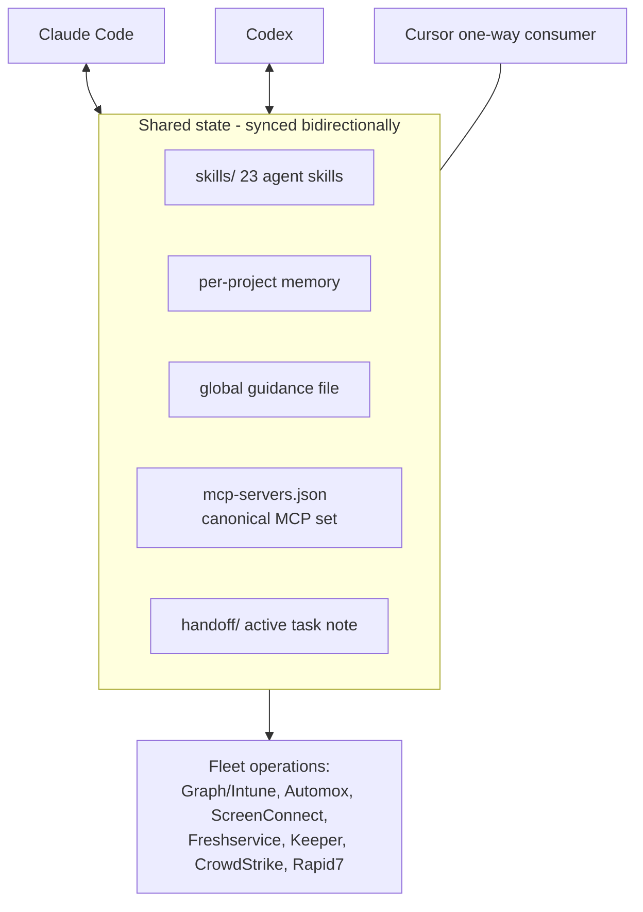

# agentic-it-ops

An AI-agent operations system for corporate IT, built and run in production through 2026. It makes Claude Code, Codex, and Cursor interchangeable operators of the same IT environment: shared procedures, shared memory, shared MCP servers, and a handoff protocol so a task started in one tool resumes in another instead of restarting.

The one-line pitch: **runbooks that execute.** Instead of a wiki nobody reads next to a terminal nobody scripts, every operational procedure is an agent skill the AI loads and follows, with approval gates where production gets touched.

All employer identifiers are anonymized (see [ANONYMIZATION.md](ANONYMIZATION.md)). The scripts and skills are the real, working versions.

## Architecture

Three pieces make it work:

**1. Skills as shared procedure memory.** One folder per skill, `SKILL.md` plus reference files and scripts. The catalog below covers Graph token handling, remote diagnostics, secret retrieval, ticket workflows, app packaging, and more. A routing-index skill (`it-operations`) sits on top: any IT task loads it first, and it points to the specialist skill. Skills hold *procedures*; facts live in memory files; the sync keeps a fact in exactly one place.

**2. The sync engine.** `ai-sync/sync-ai-context.ps1` mirrors skills, guidance, per-project memory, and MCP server definitions between the tools' home directories. Bidirectional, newest-wins by timestamp, every overwrite backed up first, deletions honored through a state manifest instead of resurrecting, and conflicts (divergent edits within seconds of each other) skipped and logged rather than guessed at. It also generates each tool's native skill metadata, so a skill written once is discoverable everywhere. Design details in [ai-sync/SYNC-DESIGN.md](ai-sync/SYNC-DESIGN.md).

**3. The handoff protocol.** `ai-sync/handoff.ps1` writes a single active note when you leave a task mid-flight: constraints, what's done, dead ends, next step. Every tool prints it at session start, so the next session (in any tool) resumes instead of rediscovering. Notes archive on replacement and go stale after 24 hours.

MCP servers get the same treatment: one canonical `mcp-servers.json` projected into each tool's native config, with secret-looking values never stored — they stay as vault references (`keeper://...`) and each tool resolves them locally.

## Guardrails, because agents touch production

These are not aspirational; each one exists because of a real incident or near-miss, and they're written into the skills the agents load:

- **Silent means read-only.** "Silently diagnose this ticket" performs GETs only. A ticket ID in a prompt is not write permission. This rule exists because an agent once assigned a ticket and added a note during a "silent" diagnosis; both writes were reverted and the rule became part of the corpus.
- **Production writes need explicit approval** in the conversation, every time. Intune, Automox, ScreenConnect, and Freshservice changes all gate.
- **Secrets never enter transcripts.** Retrieval goes through the vault skill, which knows which command forms mask values and which dump cleartext.
- **Verify independently after remote writes.** A command's exit code is not evidence; the originating system is re-read.

## Skills catalog (23)

| Domain | Skills |
|---|---|
| Routing | `it-operations` (the index every task loads first) |
| Identity & Graph | `acquire-graph-token`, `check-autopilot-serials` |
| Endpoints | `screenconnect-remote-diagnostics`, `ssh-access`, `triage-windows-bsod`, `manage-cato-client`, `enroll-apple-device-abm-intune`, `review-intune-byod-app-protection` |
| Packaging & patching | `package-intune-win32-app`, `deploy-automox-worklet` |
| Security | `query-crowdstrike-falcon`, `analyze-vulnerability-kpis`, `retrieve-keeper-secret` |
| ITSM & workflow | `freshservice-automation-builder`, `freshservice-service-catalog`, `prepare-cab-change-ticket`, `run-intune-maa-teams-notifier`, `build-power-automate-flow` |
| Comms & meta | `draft-it-announcement`, `create-fedex-label`, `switch-ai-tools`, `author-shared-skill` |

`author-shared-skill` is the meta-skill: it defines when a procedure earns a skill (failed twice before working, assembled from scattered sources, corrected by a human), when it doesn't (one-offs, things a model does cold), and caps the library size so the routing budget stays sharp.

## Case studies

- [Vulnerability burn-down](case-studies/vulnerability-burndown.md) — how agent-driven correlation across Rapid7, Intune, and Automox separated scanner lag from truly unpatched machines and turned ~2,800 aged critical findings into a sequenced, ring-based fix plan
- [Freshservice approval gate](case-studies/freshservice-approval-gate.md) — a native Workflow Automator design that inserts a security review into the request pipeline without stalling tickets
- [Intune MAA Teams notifier](case-studies/intune-maa-teams-notifier.md) — scheduled Graph automation that posts pending multi-admin approvals into Teams so change control stops being a portal-polling chore

## Stack

PowerShell 7 (sync engine), Markdown skills (portable across Claude Code / Codex / Cursor), Microsoft Graph API, MCP servers, Keeper Secrets Manager, and the fleet systems the skills operate: Intune, Automox, ScreenConnect, Freshservice, CrowdStrike, Rapid7.
